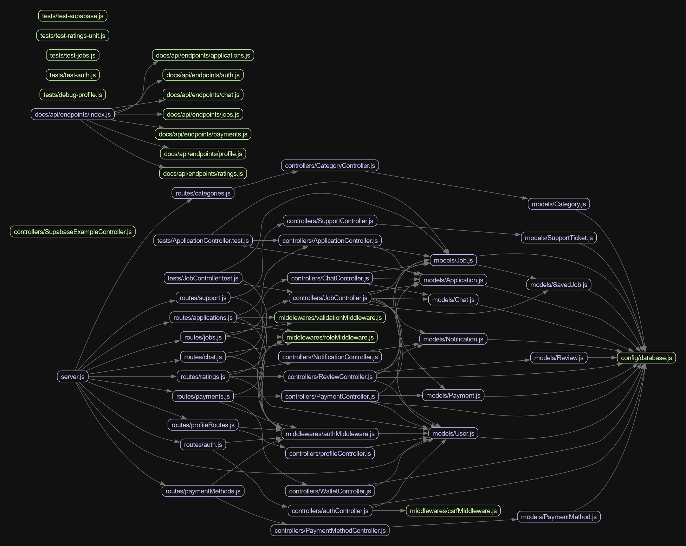

see for ts: https://github.com/taskhub-xixi/th-backend-nestjs
# TaskHub Backend API

TaskHub is a job marketplace backend API that connects task posters with taskers. Built with Express.js and Supabase (MySQL).

## Architecture



Server runs on `http://localhost:5000`

## API Endpoints

### Auth

- `POST /api/auth/register` - Register new user
- `POST /api/auth/login` - Login user
- `POST /api/auth/logout` - Logout user
- `GET /api/auth/me` - Get current user

### Profile

- `GET /api/user/profile` - Get user profile
- `PUT /api/user/profile` - Update profile
- `POST /api/user/profile/avatar` - Upload avatar

### Jobs

- `POST /api/jobs` - Create job (poster only)
- `GET /api/jobs` - List jobs
- `GET /api/jobs/:id` - Get job details
- `PUT /api/jobs/:id` - Update job (poster only)
- `DELETE /api/jobs/:id` - Delete job (poster only)

### Applications

- `POST /api/applications/jobs/:id/apply` - Apply to job (tasker only)
- `GET /api/applications/jobs/:id/applications` - List applications (poster only)
- `PUT /api/applications/applications/:id/accept` - Accept application
- `PUT /api/applications/applications/:id/reject` - Reject application
- `GET /api/applications/my-applications` - My applications

### Payments

- `POST /api/payments` - Create payment
- `GET /api/payments/:id` - Get payment details
- `GET /api/payments/job/:jobId` - Get job payment
- `GET /api/payments/wallet` - Get wallet balance
- `POST /api/payments/wallet/add-funds` - Add funds
- `POST /api/payments/wallet/withdraw` - Withdraw funds

### Ratings & Reviews

- `POST /api/ratings/reviews` - Create review
- `GET /api/ratings/jobs/:jobId/reviews` - Get job reviews
- `GET /api/ratings/users/:userId/reviews` - Get user reviews
- `GET /api/ratings/users/:userId/rating` - Get user rating

### Chat

- `POST /api/chat/conversations` - Create conversation
- `GET /api/chat/conversations` - List conversations
- `POST /api/chat/conversations/:id/messages` - Send message
- `GET /api/chat/conversations/:id/messages` - Get messages

### Support

- `POST /api/support/tickets` - Create support ticket
- `GET /api/support/tickets` - List tickets

### Categories

- `GET /api/categories` - List categories

## Project Structure

```
th-backend/
├── models/           # Database models
├── routes/           # API routes
├── middlewares/       # Express middlewares
├── docs/api/         # API documentation
├── uploads/          # Uploaded files
├── server.js         # Entry point
└── package.json
```

## Security Features

- HttpOnly cookie authentication
- CSRF token protection
- Role-based access control
- Input validation
- Password bcrypt hashing
- SQL injection prevention (via parameterized queries)

## License

ISC
